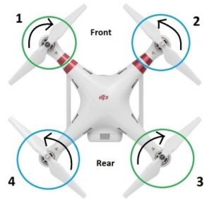
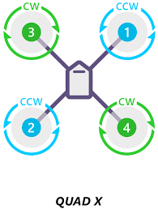
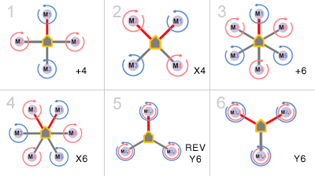
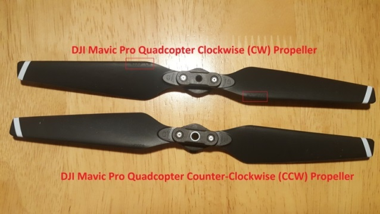

# Dynamics

## Motor Layout

- Front Left – Clockwise motor (CW)
- Front Right – Counter Clockwise motor (CCW)
- Back Left – Counter Clockwise motor (CCW)
- Back Right – Clockwise motor (CW)

Other configurations are possible too:

## Propellers

- Length: The first is length (Diameter), usually given in inches. The length of a propeller is the diameter of a disc the prop makes when it’s spinning. The higher the Kv rating of your motors, the smaller your props need to be. Smaller props allow for greater speeds, but reduced efficiency. A larger prop setup (with correspondingly low Kv motors) is easier to fly steadily. It also uses less current and lifts more weight.
- Prop Pitch: This second measurement is also very important. Prop dimensions are quoted in the form 21 x 7.0 inch (533 x 178 mm) which is the DJI E2000 propulsion system. The first number refers to the propeller length as above. The second is pitch, defined as the distance a prop would be pulled forward through a solid in a single full revolution.  For example this propeller with a 7.0 inch pitch would move forward 7.0 inches in one revolution.
- Bore: The last is known as bore measurement, which is simply the size of the hole in the center of the prop. This must be matched to the shaft of your chosen motors. Adapters are available to downsize a prop’s bore. Alternatively, some props, such as those produced by T-Motor, use a direct mounting system whereby screws secure the props directly to the motor head.
- Self Locking: Most quadcopters today use Self Locking props.  They call these “Self locking”, because on a quadcopter, 2 motors  are spinning clockwise and the other 2 are spinning counter clockwise. By using propeller threads that are the opposite to motor spin direction, the props automatically lock themselves down and won’t come loose when flying.

Note: Make sure that the placement of propellers on the motors are proper. You want to place a CCW propeller on a CCW motors etc.

# References

- [Good definitions and overview of construction](https://www.dronezon.com/learn-about-drones-quadcopters/how-a-quadcopter-works-with-propellers-and-motors-direction-design-explained/)

- [accel](https://makersportal.com/blog/2017/9/25/accelerometer-on-an-elevator)
- [accel and gyros](https://www.raspberrypi.org/forums/viewtopic.php?t=127930)
- [quadcopters](http://www.brokking.net/)
- [simulating quads](http://charlestytler.com/modeling-vehicle-dynamics-euler-angles/)
- [more qud](http://quadcoptersource.tesb1.com/quadcoter-videos/high-speed/ymfc-al-build-your-own-self-leveling-arduino-quadcopter-with-schematic-and-code/)
- [berry imu](https://github.com/ozzmaker/BerryIMU)
- [robotshop tutorials for drones](https://www.robotshop.com/community/tutorials/show/how-to-make-a-drone-uav-lesson-4-flight-controller)
- [flight constoller](https://blog.owenson.me/build-your-own-quadcopter-flight-controller/)
- [px4 auto pilot](https://github.com/PX4)
- [quad KF 22 state](https://github.com/priseborough/InertialNav/blob/master/derivations/GenerateEquations22states.m)
- [quad ins](https://github.com/priseborough/InertialNav)
- [digital compass calibration](https://thecavepearlproject.org/2015/05/22/calibrating-any-compass-or-accelerometer-for-arduino/)
