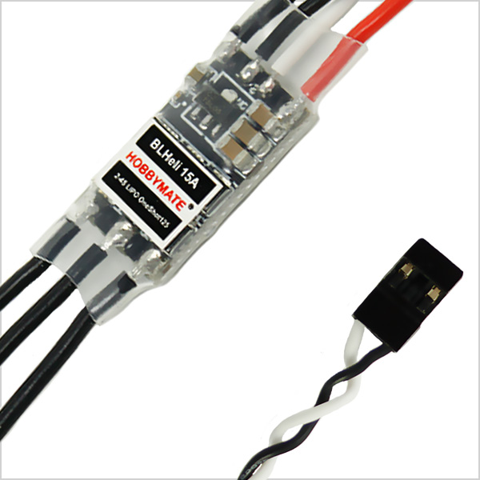

# Hobbymate 15A ESC (BLHeli-15A)

HOBBYMATE 15A ESCs have all the performance you would hope for and you will 
struggle to find a frame small enough to fit these ESCs and they will still 
give you plenty of headroom on a standard 180 210 250 size quad!
Oneshot125 is a different and faster communication protocol between the flight 
controller and the ESC on your quadcopter.

- Hobbymate 15A BLheli ESCs : Support OneShot ultra-high speed control and Bi-directional rotating. All N-FET design with external oscillator for steady performance across different thermal and voltage conditions.
- Hobbymate Upgrade 15A BLheli ESCs, bootloader, Based on BLHeli firmware with low voltage protection, over heat protection and self check functions Works with 2S to 4S input – Rated at 15A continuous and 25A burst .

## Specification:

- Input: 2-4s Lipo  (7.4V - 14.8V)                  
- Constant: 15 Amps
- Burst: 25 Amps                     
- Weight: 4g bare board
- Dimensions: 23×12.5x3mm  
- Motor wire: 70mm
- Signal wire: 120mm              
- PCB – 4 Layer Blind hole PCB – 3oz Pour
- Mosfet: N-Channel               
- OneShot and BLHeli 16.2 Pre Installed

## Timings

Supports standar 1-2 msec RC servo timings at >= 50Hz

- Minimum: 920 - 1050 usec (or 0.920 - 1.05 msec)
- Middle: 1500 usec
- Max 1800 - 2000 usec

## Power ON Sequence

1. Turn power on: 3 short rising tone beeps
2. Set middle throttle: 1 long low tone beep
3. Set zero throttle: 1 long high tone beep
4. Motor is ready to command
