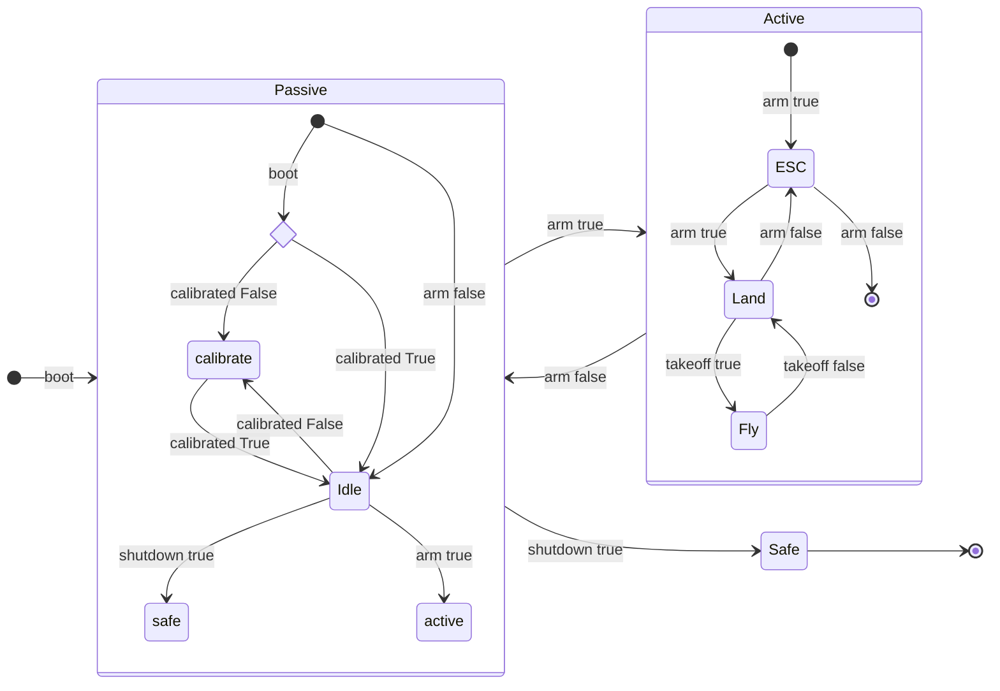

# Flight Controller

```mermaid
stateDiagram-v2
    direction LR
    [*] --> Idle: boot
    Idle --> [*]: shutdown
    Idle --> Armed: arm
    Armed --> Idle: unarm

    state Armed {
        [*] --> Land
        Land --> Fly: takeoff
        Fly --> Land: land
        Land --> [*]: unarm
    }

    state Idle {
        state if_cal <<choice>>
        [*] --> if_cal
        if_cal --> calibrate: Calibrated False
        if_cal --> ready: Calibrated True
        calibrate --> ready: complete
        ready --> calibrate: calibration msg
        ready --> safe: shutdown
        safe --> [*]: shutdown
        ready --> [*]: arm
    }

    state Fly {
        [*] --> Hover
        Hover --> [*]: land
        Hover --> Move: cmd_js
        Move --> Hover: cmd_home
        Move --> Move: cmd_js
    }

    state Land {
        state ESC <<choice>>
        [*] --> ESC
        ESC --> ESC_up: ESC_down
        ESC --> ESC_down: ESC_up
        ESC_down --> hold
        ESC_up --> hold
        hold --> [*]: unarm
        hold --> [*]: takeoff
    }
```

```mermaid
stateDiagram-v2
    direction LR
    [*] --> Passive: boot
    Passive --> Active: arm true
    Active --> Passive: arm false
    Passive --> Safe: shutdown true
    Safe --> [*]


    state Active {
        [*] --> ESC: arm true
        ESC --> Land: arm true
        Land --> Fly: takeoff true
        Fly --> Land: takeoff false
        Land --> ESC: arm false
        ESC --> [*]: arm false
    }

    state Passive {
        state if_cal <<choice>>
        [*] --> if_cal: boot
        if_cal --> calibrate: calibrated False
        if_cal --> Idle: calibrated True
        calibrate --> Idle: calibrated True
        Idle --> calibrate: calibrated False
        Idle --> safe: shutdown true
        Idle --> active: arm true
        [*] --> Idle: arm false
    }
```
