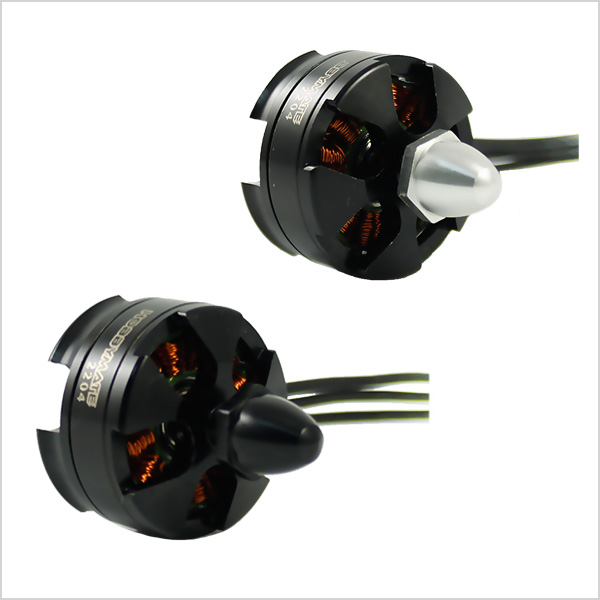
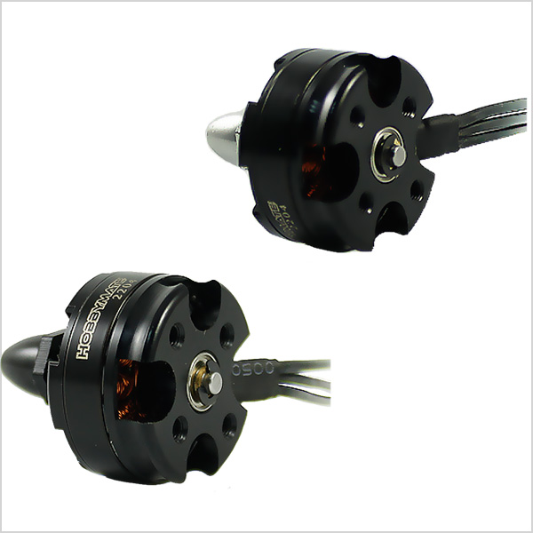

# 2204 Brushless Motors

## Features:

Air suction system design, rapid cooling, higher efficiency and longer life ; U clip prevents bearing from loosening ;
Original NMB bearings, no counterfeit bearings from any other source;
High precision CNC machining exquisite design, stern quality control revealing the user taste and position ;
The rotation direction of motor was marked on the front bell, making it easier to determine rotation direction for CW and CCW motors;
Low CG design, decreasing vibration when motor runs  ;  Light weight built ;
Longer duration of flight ; Designed for mini multicopters, better flight performance ;
CW and CCW propeller adapters included, holding the propellers tight ;
100% balanced, decreasing vibration to the minimum ;

- Hobbymate 2204 2300KV 2 Pairs CW CCW Brushless Motors and ESCs Combo for FPV racing Quadcopter
- Perfect for FPV QAV Quadcopters 180 210 250 size and other small drone
- Hobbymate 2204 Motors : Air suction system design, rapid cooling, higher efficiency and longer life U clip prevents bearing from loosening Original Japanese bearings, no counterfeit bearings from any other source High precision CNC machining exquisite design, stern quality control revealing the user taste and position

## 2204 Motor Specification :

- KV: 2300
- MAX Thrust: 440 G        
- Length: 32.2 MM
- NO.OF CELL:2~3S        
- Weight: 25 G
- Framework: 12N14P     
- Shaft : 3 MM
- Propeller: 5″~6″             
- Diameter: 27.9 MM
- Silver hub: [CCW](https://hobbymatehobby.com/product/2204-2300kv-cw-brushless-motor-2204ccw-w/)
- Black hub: [CW](https://hobbymatehobby.com/product/2204-2300kv-ccw-brushless-motor-2204ccw-b/)

# Kv (Constant Velocity)

“Kv” refers to the constant velocity of a motor. It is measured by the number
of revolutions per minute (rpm) that a motor turns when 1V (one volt) is
applied with no load attached to that motor. The Kv rating of a brushless motor
is the ratio of the motor’s unloaded rpm to the peak voltage on the wires
connected to the coils.

Knowing the Kv rating of a motor will help you determine how fast that motor will rotate when a given voltage is applied to it. For example:

| a 980Kv motor powered by an 11.1V battery would spin at 10,878 rpm (980 x 11.1) with no load

A change in voltage will change the rpm and will require changing the propeller to avoid overloading the motor. Kv allows you to get a handle on the torque that can be expected from a particular motor. Torque is determined by the number of winds on the armature and the strength of the magnets. A low Kv motor has more winds of thinner wire—it will carry more volts at fewer amps, produce higher torque, and swing a bigger prop. A high Kv motor has fewer winds of thicker wire that carry more amps at fewer volts and spin a smaller prop at high revolutions.
