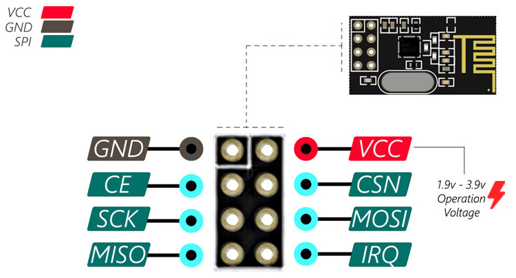
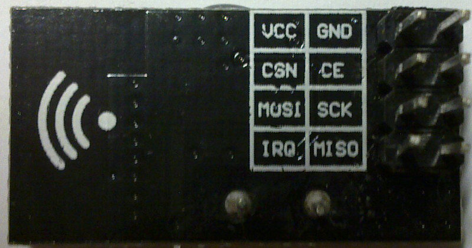

# nRFL01

| So these appear to be either TX or RX and **not duplex**, but maybe I can figure something out

- Built-in 2.4 GHz antenna, maximum operating speeds up to 2Mbps.
- Transmission Power: 7 dBm@5 mW.
- Typical Range: 150~240 m.
- Receiving Seneitivity: -96dBm @250Kbps.
- Voltage Range: 2.0-3.6 V.
- Turn-off Current: 0.7 μA.
- Receive Current (2Mbps): 12.8 mA.
- GFSK modulation efficiency, Anti-interference ability, Particularly suitable for industrial control applications.

## Pinout

| Pin  | Function
|------|-------------------|
| `CE` | TX or RX
| `CSN`| SPI Chip Select
| `IRQ`| maskable interrupt pin, active low
| `SCK`| SPI clock
| `MOSI` \ `MISO`| SPI data

## References

- [datasheet](./nRF24L01_datasheet_v2.pdf)
- github: [RF24 drivers](https://github.com/nRF24/RF24) for a variety of boards