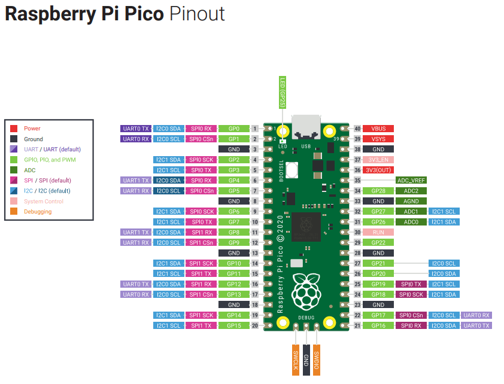
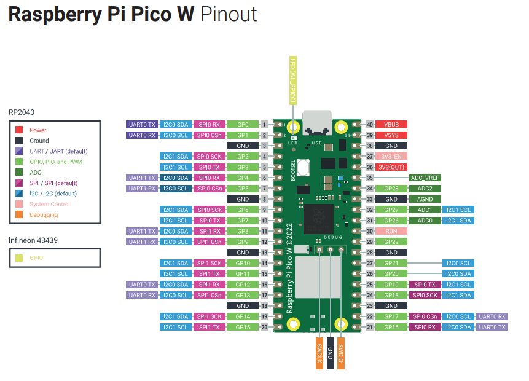

# Pico





- [Arudino-Pico readthedocs](https://arduino-pico.readthedocs.io/en/latest/index.html)
- [Raspberry Pi Pico and Pico W Pinout Guide](https://randomnerdtutorials.com/raspberry-pi-pico-w-pinout-gpios/)

## Serial

- `Serial1` / `uart0` uses TX(`0`) / RX(`1`)
- `Serial2` / `uart1` uses TX(`8`) / RX(`9`)

```cpp
// call these before begin
Serial1.setRX(pinRX);
Serial1.setTX(pinTX);
Serial1.setFIFOSize(128); // default 32
Serial1.begin(baud);
```


## ADC

- ADC on pins 26, 27, 28
- `ADC3` measures `VSYS`
- `ADC4` measures CPU temperature sensor

## Pins

- `RUN` set `LOW` to reset the uC
- `VSYS` is the external power input which is probably the USB and ranges between 1.8V-5.5V
- `VBUS` is power from the USB input, typicall 5V